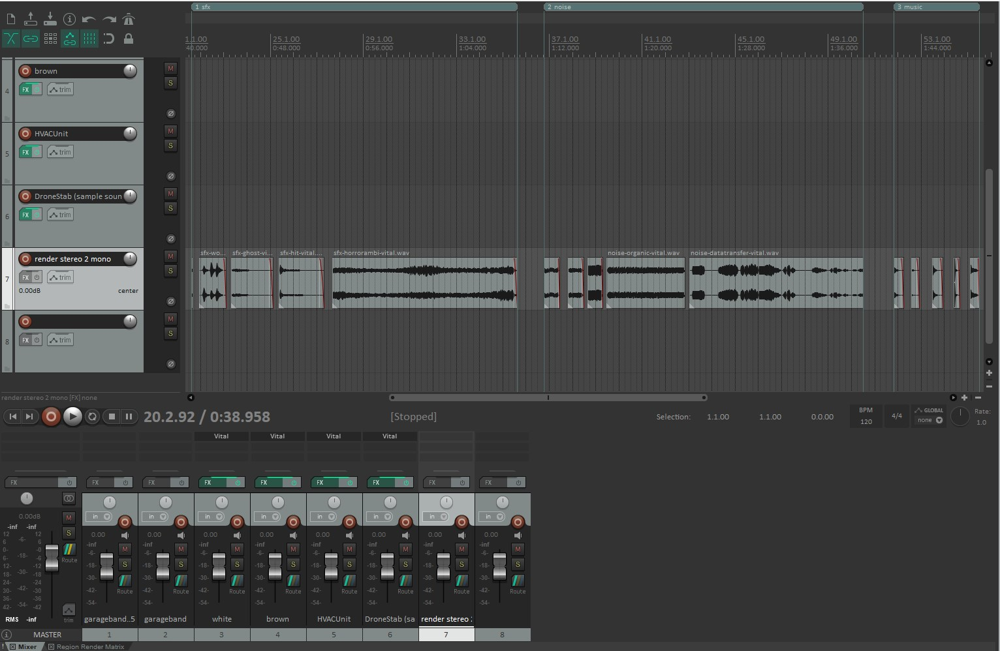
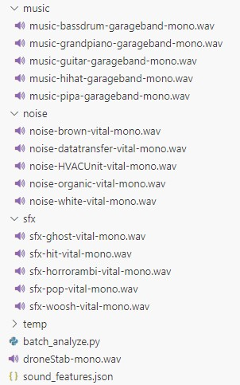

# Noise Generator

## Description

Noise Generator is a web-based application written in Python that allows users to interactively create noises that can be used to create sound effects or music.

This program supports:
* Generating noise with either a uniform or Gaussian distribution
* Adding a loudness low frequency oscillation (LFO) to the noise
* Adding a loudness envelope (ADSR) to the noise
* Randomizing the parameters used for creating the noise
* Playing back the generated noise
* Plotting the noise's feature comparison with the three categories: noise, sfx, and music
* Plotting the waveform and spectrum of the noise

#### Requirements

Libraries and modules including os, matplotlib.pyplot, soundfile, datetime, numpy, essentia.standard, json, flask, numpy, wave, io, base64 are used in this program.

## Sound Preparation

Create the three set of sounds: noise, sfx, and music using Vital and Garage Band; and one sample sound ("droneStab-mono.wav" in this case).

## Batch Analyze
Use `batch_analyze.py` to extract sound features from three sets of sounds: noise, sfx, and music. Save the analyzed features to a JSON file, and plot the comparison of the features of a sample sound against the analyzed features of the three sets.

### batch_analyze.analyze_features(signal, fs)

Analyze audio features using Essentia.

**Parameters:**
* signal (numpy.ndarray) – Input signal.
* fs (int) – Sampling rate in Hz.

**Returns:**
* log_attack_time_value and centroid of the signal.

**Return type:**
* tuple(float, float)

### batch_analyze.analyze_and_save_folder_features(folder_path, label, features_dict, fs=44100)

Analyze all sounds in a folder and save their features to a dictionary.

**Parameters:**
* folder_path (str) – Path to the folder (noise, sfx, music) containing sounds.
* label (str) – Label (noise, sfx, music) of the audio to add to the features dictionary.
* features_dict (dict) – Initialized features dictionary containing keys for storing analyzed sound features.
* fs (int, optional) – Sampling rate in Hz, defaults to 44100.

### batch_analyze.save_features_to_file(features_dict, file_path='sound_features.json')

Save analyzed sound features to a JSON file.

**Parameters:**
* features_dict (dict) – Loaded dictionary containing pre-analyzed sound features.
* file_path (str) – Output file path.

### batch_analyze.load_features_from_file(file_path='sound_features.json')

Load sound features from a JSON file.

**Parameters:**
* file_path (str) – File path of the JSON file containing pre-analyzed sound features.

**Returns:**
* Loaded dictionary containing pre-analyzed sound features.

**Return type:**
* dict

### batch_analyze.plot_cluster_comparison(noise, noise_label, features_dict, fs=44100)

Save a feature comparison plot between clusters and the generated noise (the sample sound in this case).

**Parameters:**
* noise (numpy.ndarray) – The generated noise data.
* noise_label (str) – Label for the generated noise.
* features_dict (dict) – Dictionary containing pre-analyzed sound features.
* fs (int, optional) – Sampling rate in Hz, defaults to 44100.

### batch_analyze.main()

Main function to generate, analyze and compare the noise.

## Flask App

Use `app.py` to interact with a web page, generate noise, play the generated noise, plot its waveform and spectrum, plot its feature comparison against the three clusters: noise, sfx, and music.

### app.generate_noise(fs=44100, noise_type='uniform', duration=0.5, mean=0, std=1, lfo_freq=0, adsr_params=None)

Generate noise signal.

**Parameters:**
* fs (int) – Sampling rate in Hz, defaults to 44100.
* noise_type (str) – Generating noise with either a uniform or Gaussian distribution. Uniform noise: Values are uniformly distributed between -1 and 1. Gaussian noise: Values follow a normal distribution with specified mean and standard deviation.
* duration (float) – Duration of the noise in seconds.
* mean (float, optional) – Mean for Gaussian noise, defaults to 0.
* std (float, optional) – Standard deviation for Gaussian noise, defaults to 1.
* lfo_freq (float, optional) – LFO frequency in Hz, defaults to 0.
* adsr_params (list[float], optional) – ADSR parameters in seconds, defaults to None.

**Returns:**
* WAV file in memory and generated noise signal (float32 values).

**Return type:**
* tuple(io.BytesIO, numpy.ndarray)

### app.apply_lfo(noise, fs, lfo_freq)

Apply loudness low frequency oscillation (LFO) to a signal.

**Parameters:**
* noise (numpy.ndarray) – Input signal.
* fs (int) – Sampling rate in Hz.
* lfo_freq (float) – Frequency of the LFO in Hz.

**Returns:**
* Signal modulated with LFO.

**Return type:**
* numpy.ndarray

### app.apply_adsr(noise, fs, adsr_params)

Apply loudness envelope (ADSR) to a signal.

**Parameters:**
* noise (numpy.ndarray) – Input signal.
* fs (int) – Sampling rate in Hz.
* adsr_params (list[float]) – List containing [attack, decay, sustain, release] times in seconds.

**Returns:**
* Signal shaped with ADSR envelope.

**Return type:**
* numpy.ndarray

### app.analyze_features(signal, fs)

Analyze audio features using Essentia.

**Parameters:**
* signal (numpy.ndarray) – Input signal.
* fs (int) – Sampling rate in Hz.

**Returns:**
* log_attack_time_value and centroid of the signal.

**Return type:**
* tuple(float, float)

### app.load_features_from_file(file_path='sound_features.json')

Load sound features from a JSON file.

**Parameters:**
* file_path (str) – File path of the JSON file containing pre-analyzed sound features.

**Returns:**
* Loaded dictionary containing pre-analyzed sound features.

**Return type:**
* dict

### app.plot_cluster_comparison(noise, noise_label, features_dict, fs=44100)

Plot clusters and compare generated noise using sound features.

**Parameters:**
* noise (numpy.ndarray) – The generated noise data.
* noise_label (str) – Label for the generated noise.
* features_dict (dict) – Dictionary containing pre-analyzed sound features.
* fs (int, optional) – Sampling rate in Hz, defaults to 44100.

**Returns:**
* Data dictionary for the scatter plot.

**Return type:**
* dict

### app.index()

Render the main webpage.

**Route:** /

**Returns:**
* Rendered HTML template for the index page.

**Return type:**
* str

### app.generate()

Handle POST requests to generate noise and return audio data.

**Route:** /generate

**Returns:**
* JSON response containing audio data and features.

**Return type:**
* flask.Response

## Limitations

### Sound Preparation

More sound files could be created and used in feature extraction, making the feature comparison scatter plot more meaningful.

### Flask App

Could add a bandpass filter to manipulate frequency components.

A spectrogram of the generated noise mihgt be useful.

Other descriptors from the essentia library could be used, including spectral contrast, dissonance mean, and mfcc mean.

Could add other visual representations of the generated noise, such as an animation.

### HTML

Could use Bootstrap for styling if more features are added.

## Bugs

Major When using `Randomize`, the console log of duration and adsr times differs from the display.

Minor The audio playback on the Web page is loud.

Minor Warning: essentia can currently only accept numpy arrays of dtype "single". "array" dtype is double. Precision will be automatically truncated into "single".
